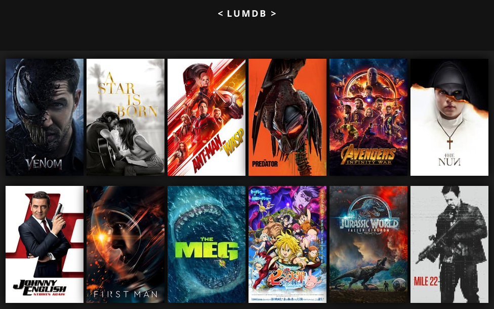

<h1>React Dynamic Movie Viewer</h1>

  

This is an app which uses the themoviedb.org api to show movies with their own dynamic pages.

<h3>Local Installation</h3>
<ul>
  <li>git clone https://github.com/logmannn/React-dynamic-movie-viewer</li>
  <li>cd devconnector</li>
  <li>npm install</li>
  <li>cd client</li>
  <li>npm install</li>
  <li>cd ..</li>
  <li>npm start</li>
  <li>Go to <a href="http://localhost:3000/">http://localhost:3000/</a></li>
</ul>

<h3>Features</h3>
<ul>
  <li>A page which shows a list of recent movies pulled from the themoviedb.org api</li>
  <li>Navigation which allows you to browse multiple pages of movies</li>
  <li>A dynamic movie specific page which shows more information about the movie.</li>
</ul>

<h3>Images</h3>

